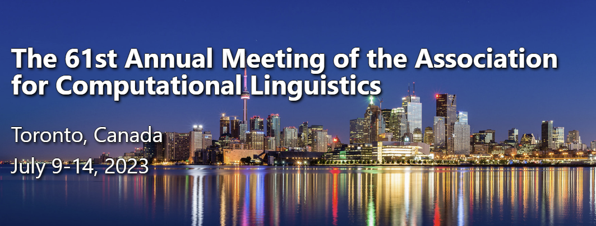

## Mindset

Before knowing which venues to submit, let's first understand how do we know is good venues:

1. For conferences, you should just ask your supervisor what is among the best conference in your domain.  For example, in NLP, we all know ACL, EMNLP, etc., are very prestigious conference.  Another way to check is simply search inside Google Scholar rankings such as [this](https://scholar.google.co.th/citations?view_op=top_venues&hl=en&vq=eng_computationallinguistics).   I feel Google Scholar rankings are quite valid to certain extent.
2. For journals, there is a lot of controversies here but the basic number here to look for is the **impact factor**.  Impact Factor is a bit controversial as it greatly differs across disciplines and it can be manipulated.  In any case, **avoid submitting to journals that have (1) no impact factor, (2) no rigorous peer-review process (at least 2+ reviewers), or (3) has volume number of 1 (or 2) which indicates that it is fairly new; try submitting to legacy journals which are usually the top-tier and reliable journals in the field.**

Now, coming to strategy, my personal strategy is very simple, i.e.,**to first aim the best possible, i.e., the flagship conferences/journals.  This is because I believe I and my student will learn the most through the process.**  **Do not be ashamed if it gets rejected.**  By always aiming for the best venue and repeating this process, you as a researcher will become better.    Of course, you can always revise your rejected work and submit elsewhere.

Of course, this should also be put into consideration your timeframe and your supervisor.  Sometimes, aiming the best can do more harm than good, i.e., you may be better off working on some easy journals and gain your confidence before trying the best.     Thus please do not overdo it, many lesser-know conferences / journals are very good, thus consult your supervisor.

In any case, good luck.
