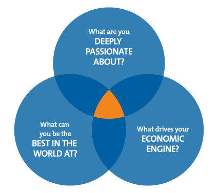
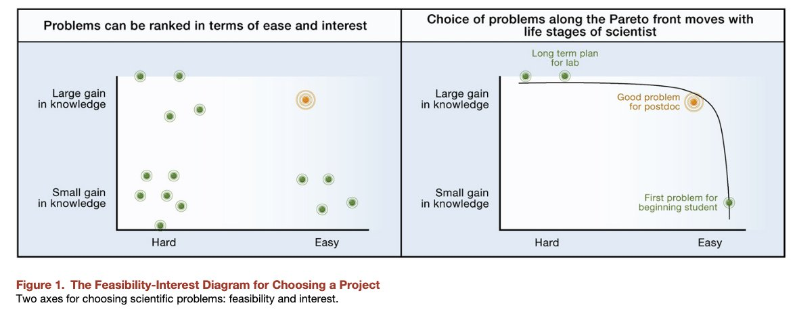
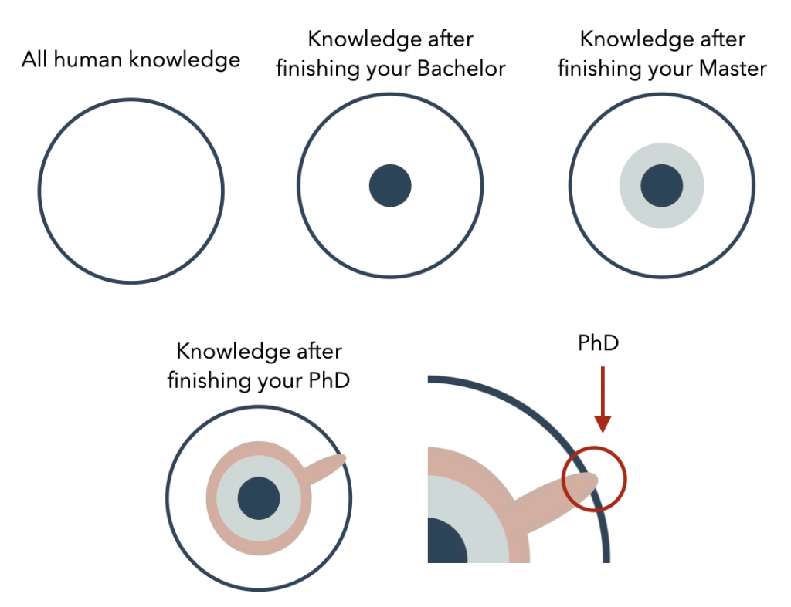

New students often have difficulty identifying their topic. Here I provide here some useful heuristics:

**Hedgehog**

A good topic is usually an intersection between **what you are good at**, **what you are passionate about**,  and **the list of open problems which researchers in your area think it is important**.

The key point is to be as specific as possible in thinking about these three dimensions.

For passion, be specific what triggers your fascination.

For open problems, it is your economic engine, you have to read lots of papers and talk with a lot of people to understand what researchers think is important, NOT what you think is important.

Last, think about one specific area where you can be the best of.

**Relevancy**

Try to think of a topic where it will be relevant even after 10 years.  You may not want to do any topic that can only last for 1 or 2 years.  Research is about thinking ahead.  Research comes with greater freedom and the privilege to take higher risk.  You may not want to work on “how to increase the battery life of a mobile phone”.  This is one of industry work.  It does have an important impact but its impact is only short-termed.  Distinguish what is industry work and research work.  There is an overlap but there is also a clear distinction.  You should envision what you want the future to be. Those are the topics you wanna work on.  **Imagine a topic that you will work even after you finish your Ph.D. for five or more years.**

**Feasibility  (credits: Uri Alon)**

****

The main idea of this diagram is that you can identify your topic based on feasibility.  To check feasibility, ask, do you have the skillset to do?  Do you have the technology to support your research?  Do you have the dataset?  Do you have enough time?  Do you know how to analyze?  Do you think that your work will really 'work'? What are the strengths of your lab and your supervisor?

For beginners like a first-year Ph.D./Master student, **it is strongly advised to tackle small, but a significant problem that is relatively easy according to your current skill level + your lab expertise.  For example, a small but significant problem could be studying a well-known problem with the well-established methodology but with a slight change in the factors being studied.**  This small but significant problem is usually published in one single paper. All beginners should start from this - because this will provide you training that requires tackling even harder problems. 

**Focus on depth NOT breadth (Image Credits: Capella University)**

Try to define a narrow problem you can work on.  Defining a narrow topic allows you to understand it deeply.  Ph.D. is about studying one small yet deep problem and comes up with a solid understanding of that very small problem.  If you define a wide topic, it does not allow you to scrutinize it deeply and does not allow you to come up with a concrete finding.

For example, doing a topic "Using BCI to control games” is way too wide and will yield too many directions and possibilities where none of them can be rigorously proven in the given time.  It lacks focus and depth.  In this example, you may want to focus refine your topic more deeply such that you are only investigating one or two factors very deeply.    Depth also means that you only have a few objective yet solid metrics that can validate the success of your work.

Remember that Ph.D. focuses depth, not breadth.  You can focus on breadth when you get more experienced.

**High-Level Copying**

Suppose you do all above and you are still stuck in the black hole.  Try this approach which I termed \*High-level copying\*. This skill of high-level copying is a philosophy that is based on the idea that the **quickest** way for any beginners to reach the frontier of an area is to "think" like the giants by "high-level copying" what the giants are doing and improve accordingly.    
  
The main idea is to learn what the giants/guru/experts are currently doing, what problems they found worthy of solving.  Following these giants are likely not going to get you wrong since they have already thought very deeply for over 10 years or more, what are the **state-of-the-art problems** in a research area.  They have a much higher chance to get the topic right, than new Ph.D. students who only spend a few weeks exploring a topic.  The process is simple:    
  
First, start with one recent paper from a top-tier conference / venue, make sure that it is a **really good** paper.  This will be your model paper. Now, read it several times until you fully understand every little detail,  the implementation, experimental design, and every little step in their procedure.  **Now, this is the core step, try to think what is the core limitation of this paper (tips:  usually authors write their limitations and future work at the end of the paper). Based on this limitation, what can you further do to improve?  How can you do differently?**

**Yep, that limitation will be the starting point for your topic.**

------

**Important points to remember:**

* It is important to be flexible, and **willing to throw away many “good” topics until you really reach a “great one”.**  **Finding a good problem to solve is already half battle won**.
* Leverage the resources your lab have.  It will be strange if your lab is specialized at "something" and you opt to work on some other topics.  Channel your lab strength to your benefits.
* Note that the **problem you care is not as important as the “open” problems researchers care**.  Find a good balance between these open problems and the problem you care about.
* You have a limited lifespan and one cannot be good in everything.  **Doing everything will lead to nothing.**  But **everyone (yes, everyone)** can be great in one or two things.

**For more readings:**

Excellent post what to consider when you choose a topic -<http://www.kasperhornbaek.dk/papers/interactions-9questions.pdf>

How to choose a good scientific problem?  - <http://www.imbb.forth.gr/people/aeconomou/pdf/HowToChooseGoodProblem.pdf>

What is good research - <https://www.cs.utexas.edu/~dahlin/bookshelf/hamming.html>

Read this to help you resist tempations of science - [http://www.vox.com/2016/7/14/12016710/science-challeges-research-funding-peer-review-process](https://www.vox.com/2016/7/14/12016710/science-challeges-research-funding-peer-review-process)

Complete guide - <http://www.cs.ucr.edu/~eamonn/Keogh_SIGKDD09_tutorial.pdf>
